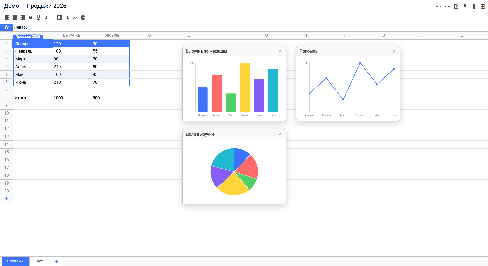
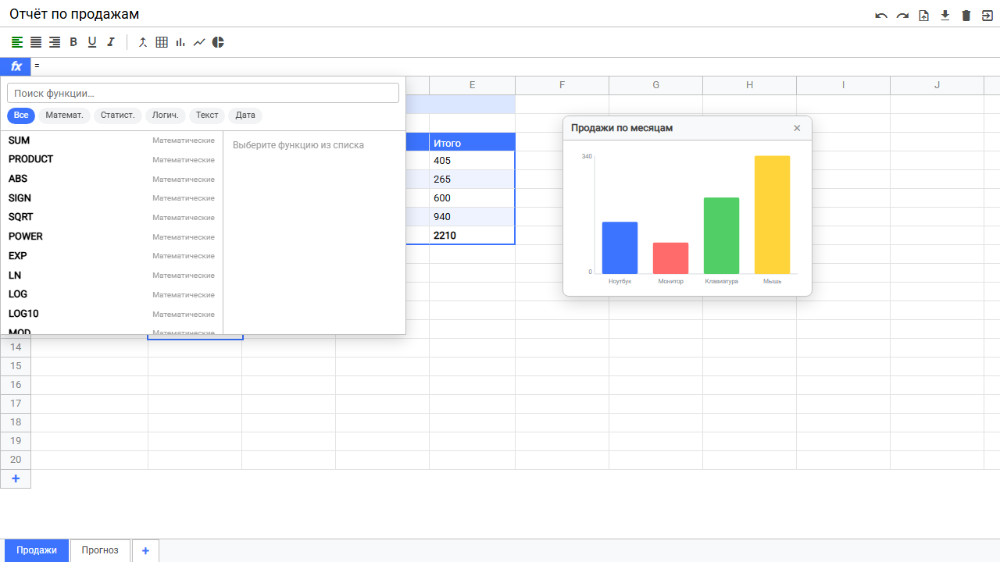
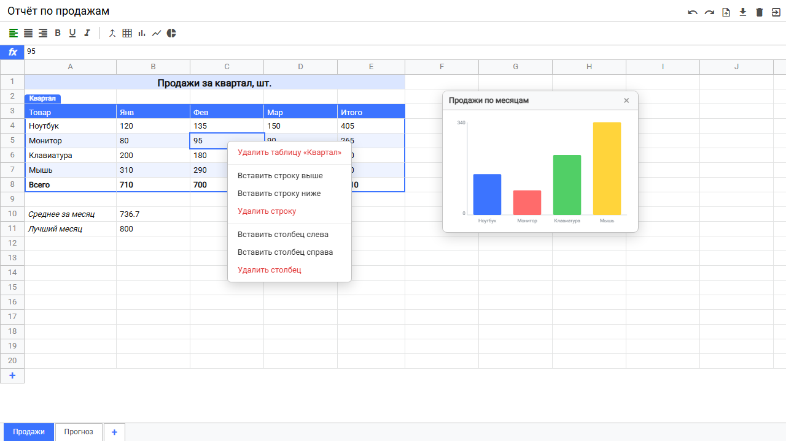
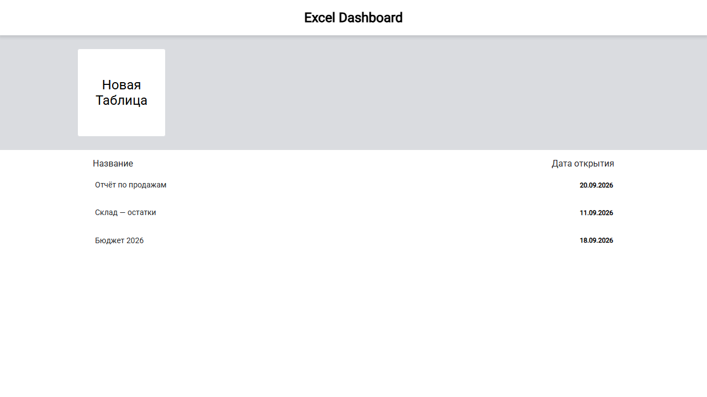

# Mini Excel — JavaScript + TypeScript

Табличный процессор в браузере, написанный без React/Vue: формулы, графики, несколько
листов, объединённые ячейки, undo/redo и импорт/экспорт `.xlsx`. Ядро — на строгом
TypeScript, интерфейс — на собственном мини-фреймворке. Сборка — Vite.

Проект вырос из учебного «excel-course» Владилена Минина.



---

## Возможности

### Таблица

- Навигация клавиатурой (стрелки, `Tab`, `Enter`), редактирование прямо в ячейке.
- Выделение мышью: протяжка прямоугольника, целые строки и столбцы по заголовкам,
  автопрокрутка у края, `Shift + клик`.
- Изменение ширины столбцов и высоты строк перетаскиванием.
- Добавление, вставка и удаление строк и столбцов (правый клик). Данные, стили, размеры,
  таблицы, графики, объединения **и ссылки в формулах** сдвигаются вместе с ними
  (`A5` → `A6`, удалённая ячейка → `#REF!`, диапазоны растягиваются и сжимаются).
- **Объединённые ячейки** — кнопка в тулбаре или контекстное меню. Значение хранит левая
  верхняя ячейка, выделение не режет объединение пополам.
- Редактируемые названия строк и столбцов (двойной клик по заголовку).
- Форматирование: выравнивание, жирный, курсив, подчёркивание.
- **Copy / Paste** (`Ctrl+C` / `Ctrl+V`): внутри приложения сохраняются формулы (относительные
  ссылки сдвигаются, `$A$1` остаются), стили и объединения; обмен с настоящим Excel идёт
  через системный буфер (TSV).
- **Undo / Redo** (`Ctrl+Z`, `Ctrl+Y`) для всех изменений документа.

### Формулы

- Ссылки `A1`, абсолютные `$A$1`, диапазоны `A1:B10`, строки `"..."`.
- Операторы `+ − * / ^ %`, конкатенация `&`, сравнения `= <> < > <= >=`.
- **60+ функций** с Excel-подобной панелью (поиск, категории, описание, синтаксис, кнопка
  «Вставить»). Панель открывается кнопкой `fx` или вводом `=` в строке формул.
  - Математика: `SUM`, `PRODUCT`, `ROUND`, `MOD`, `POWER`, `SQRT`, тригонометрия, `LOG/LN/EXP`,
    `FACT`, `GCD/LCM`, `SUMPRODUCT`…
  - Статистика: `AVERAGE`, `MEDIAN`, `MODE`, `STDEV`, `VAR`, `CORREL`, `RANK`, `COUNT/COUNTA`…
  - Логика: `IF` (ленивый — ошибка в невыбранной ветке игнорируется), `AND`, `OR`, `NOT`, `XOR`.
  - Текст: `CONCAT`, `LEN`, `UPPER/LOWER`, `TRIM`, `LEFT/RIGHT/MID`, `SUBSTITUTE`, `FIND`, `TEXTJOIN`…
  - Дата: `TODAY`, `NOW`, `DATE`, `YEAR`, `MONTH`, `DAY`.
- Автопересчёт зависимых ячеек, защита от циклов (`#CIRC!`), коды ошибок вместо `undefined`
  (`#DIV/0!`, `#NAME?`, `#REF!`, `#VALUE!`, `#ERROR!`).

### Объекты на листе

- **Таблицы-объекты** — оформление диапазона (шапка, «зебра», рамка). Перетаскиваются за бейдж
  вместе с данными, стилями и объединениями.
- **Графики** на собственном SVG-рендере: столбцы, линия, круг. Строятся по выделению
  (текстовая шапка распознаётся и в график не попадает), перетаскиваются мышью, позиция
  сохраняется. График, построенный ровно по таблице, едет за ней при переносе.

### Листы

Вкладки снизу: переключение, добавление, переименование (двойной клик), дублирование и
удаление (правый клик).

### Импорт и экспорт

- **Открытие `.xlsx` / `.xls` / `.csv`**: каждый лист файла становится вкладкой, сетка
  переносится 1:1 (A1 файла = A1 таблицы), без «первой строки как заголовков».
  - Формулы остаются живыми, если движок знает функции и считает так же, как Excel; иначе
    берётся значение из файла. Ссылки на другие листы приходят значениями.
  - Сохраняются даты, ширина столбцов, высота строк, объединённые ячейки, цвет заливки.
  - CSV разбирается своим парсером: авто-разделитель (`;` `,` tab), UTF-8 и windows-1251,
    десятичная запятая, кавычки, ведущие нули не теряются.
- **Экспорт `.xlsx`**: формулы выгружаются живыми (с кэшем значения), числа, проценты и даты —
  типизированными ячейками, плюс ширины, высоты, объединения и стили (жирный, курсив,
  подчёркивание, цвет текста, заливка, выравнивание, размер шрифта).

### Прочее

Состояние хранится в `localStorage`, маршрутизация по hash (`#` — дашборд со списком таблиц,
`#excel/<id>` — таблица). Весь пользовательский текст экранируется.

---

## Скриншоты

**Панель формул** — диалог с категориями функций:



**Контекстное меню** — вставка и удаление строк и столбцов, удаление таблицы-объекта:



**Дашборд** — список таблиц и создание новой:



---

## Запуск

Нужен [pnpm](https://pnpm.io/) (версия зафиксирована в `packageManager`).

```bash
pnpm install      # зависимости
pnpm dev          # dev-сервер, http://localhost:3000
pnpm build        # production-сборка в dist/
pnpm preview      # предпросмотр сборки
pnpm typecheck    # tsc --noEmit (strict)
pnpm test         # юнит-тесты (Vitest)
pnpm test:watch   # тесты в watch-режиме
```

---

## Стек

| Что       | Чем                                                               |
| --------- | ----------------------------------------------------------------- |
| Сборка    | Vite 6                                                            |
| Язык      | TypeScript 5 (strict) в ядре, JS в компонентах (`allowJs`)        |
| Стили     | SCSS (dart-sass)                                                  |
| Тесты     | Vitest                                                            |
| Excel I/O | `xlsx-js-style` (форк SheetJS со стилями), грузится лениво чанком |
| UI        | собственный мини-фреймворк, без React/Vue                         |

---

## Архитектура

- **`Dom`** — тонкая обёртка над DOM-узлом.
- **`ExcelComponent` / `DomListener`** — базовый компонент с декларативными слушателями.
- **`Emitter`** — pub/sub между компонентами (`$emit` / `$on`).
- **`createStore` / `StoreSubscriber`** — redux-подобный стор; компоненты получают только
  изменения ключей, на которые подписаны.
- **`Router` / `Page`** — hash-роутинг.
- **`history`** — undo/redo поверх стора (снимки состояния + склейка непрерывного ввода).

Документ — `AppState` с массивом листов `SheetState` (данные, стили, размеры, заголовки,
таблицы, графики, объединения). Все изменения идут через чистый `rootReducer`; геометрия
листа (сдвиг, перенос, вставка, объединения) вынесена в чистые функции `redux/sheetOps.ts`,
а перепись ссылок — в `core/formula/refShift.ts`. Обе части покрыты тестами без UI.

Импорты идут через алиасы `@` → `src` и `@core` → `src/core` (заданы в `vite.config.ts` и
`tsconfig.json` через `paths`, без устаревшего `baseUrl`).

```
src/
├── core/                 # фреймворк и движки (TypeScript)
│   ├── dom.ts, Emitter.ts, ExcelComponent.ts, DomListener.ts
│   ├── createStore.ts, StoreSubscriber.ts, history.ts, utils.ts
│   ├── routes/           # Router, ActiveRoute
│   ├── formula/          # токенайзер, парсер, evaluator, реестр функций, refShift
│   ├── chart/            # SVG-рендер графиков и извлечение данных
│   └── xlsx/             # import, export, csv, styles, lib (загрузка SheetJS)
├── redux/                # types, actions, rootReducer, sheetOps, initialState
├── components/           # header, toolbar, formula, table, sheet-tabs, context-menu, dialog
├── pages/                # ExcelPage, DashboardPage
├── scss/
└── constants.ts
```

---

## Горячие клавиши

| Клавиши                           | Действие                                          |
| --------------------------------- | ------------------------------------------------- |
| Стрелки, `Tab`, `Enter`           | навигация по ячейкам                              |
| `Ctrl + Z`                        | отменить                                          |
| `Ctrl + Y`, `Ctrl + Shift + Z`    | вернуть                                           |
| `Ctrl + C`, `Ctrl + V`            | копировать и вставить диапазон                    |
| `Shift + клик`                    | расширить выделение                               |
| Двойной клик по заголовку/вкладке | переименовать                                     |
| Правый клик                       | меню строк, столбцов, объединений, таблиц, листов |
| `=` в строке формул               | открыть панель функций                            |

---

## Тесты

88 юнит-тестов (Vitest): движок формул и перепись ссылок, операции над листами
(удаление, вставка, перенос, вставка диапазонов, объединения), данные и рендер графиков,
undo/redo, круговой импорт/экспорт `.xlsx` и разбор CSV.

```bash
pnpm test
```

---

## Ограничения

- Импорт читает из стилей только цвет заливки: остальное бесплатная SheetJS при чтении не
  отдаёт. Экспорт стили пишет.
- Импорт ограничен 3000 строк × 100 столбцов. Ссылки на другие листы в формулах не
  поддерживаются (при импорте берётся значение).
- Даты хранятся строками `дд.мм.гггг`, арифметики над датами нет.
- Графики строятся по одной серии.
- Перенос таблицы-объекта не пересчитывает ссылки в формулах, которые на неё указывают.
